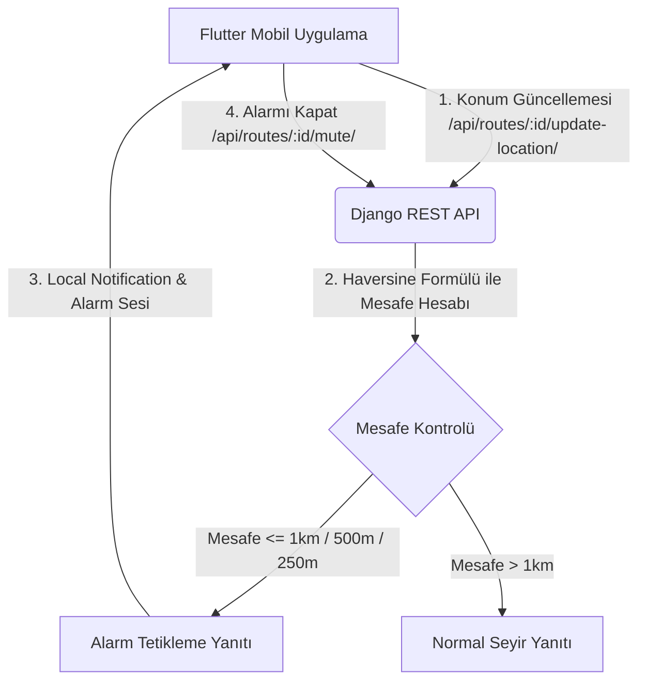

# WakeMeUp ⏰📍 - Akıllı Seyahat Alarmı ve Geofence Takip Sistemi

[](https://flutter.dev)
[](https://djangoproject.com)
[](https://mapbox.com)
[](file:///d:/MyProjects/travel/LICENSE)

**WakeMeUp**, toplu taşıma, tren veya uzun yolculuklarda hedefinize yaklaşırken uyuya kalmanızı veya durağı kaçırmanızı engellemek için tasarlanmış akıllı bir coğrafi sınır (Geofencing) alarm ve takip uygulamasıdır. 

Proje, gerçek zamanlı konum takibi yapan modern bir **Flutter** mobil uygulaması ile konum verilerini işleyip mesafeyi doğrulayan bir **Django (REST Framework)** backend servisinden oluşur.

---

## 🚀 Özellikler

- **Kademeli Alarm Sistemi**: Hedefe olan mesafeye göre 3 farklı aşamada (1 km, 500 metre ve 250 metre) akıllı bildirim ve alarm tetikleyicisi.
- **Arka Plan Servis Desteği (Background Service)**: Uygulama arka planda çalışırken veya ekran kilitliyken bile konum takibini kesintisiz sürdürür.
- **Mapbox Harita Entegrasyonu**: Mapbox Maps SDK ile zengin harita görselleştirmesi, rota çizimleri ve hedef belirleme.
- **Gelişmiş Local Notifications**: Kullanıcıyı anlık olarak uyaracak sesli ve görsel bildirim mekanizmaları.
- **Hive Yerel Veritabanı**: Hızlı erişim için çevrimdışı yerel veri saklama.
- **Mute / Susturma Yönetimi**: Kullanıcı alarmı kapattığında takibin güvenli bir şekilde durdurulması ve gereksiz tetiklenmelerin önlenmesi.
- **Haversine Formülü ile Mesafe Hesabı**: İki koordinat arasındaki gerçek mesafeyi metre cinsinden kesin hesaplama.

---

## 📐 Sistem Mimarısı

Aşağıdaki şema, mobil cihaz ile backend arasındaki veri akışını ve alarm tetikleme döngüsünü göstermektedir:



---

## 📁 Proje Yapısı

```text
WakemeUp/
├── backend/                  # Django REST Framework Backend
│   ├── geofence_backend/     # Django Proje Ayarları
│   ├── tracking/             # Konum Takip & Geofence Modülleri (API)
│   └── manage.py             # Django Yönetim Scripti
├── mobile/                   # Flutter Mobil İstemci (Client)
│   ├── lib/                  # Dart Kaynak Kodları
│   │   ├── core/             # Temalar, Servisler ve Ortak Katmanlar
│   │   └── features/         # Özellik Bazlı Sunum ve Mantık Katmanları
│   ├── assets/               # Medya, Env ve Görsel Kaynaklar
│   └── pubspec.yaml          # Flutter Bağımlılık Yönetimi
└── LICENSE                   # MIT Lisans Dosyası
```

---

## 🛠️ Kurulum ve Başlangıç

### 1. Backend Kurulumu (Django)

Backend tarafını lokalinizde çalıştırmak için aşağıdaki adımları izleyin:

```bash
# Backend dizinine geçiş yapın
cd backend

# Sanal ortam oluşturun ve aktif edin
python -m venv venv
# Windows için:
.\venv\Scripts\activate
# macOS/Linux için:
source venv/bin/activate

# Gerekli paketleri yükleyin
pip install -r requirements.txt

# Yerel geliştirmede DEBUG varsayılan olarak kapalıdır (üretimde güvenlik için).
# Statik dosyaların ve hata sayfalarının doğru çalışması için açın:
# Windows (PowerShell):
$env:DEBUG="True"
# macOS/Linux:
export DEBUG=True

# Veritabanı geçişlerini (migration) uygulayın
python manage.py migrate

# Geliştirici sunucusunu başlatın
python manage.py runserver
```
*Varsayılan olarak backend `http://127.0.0.1:8000/` adresinde çalışacaktır.*

### 2. Mobil Uygulama Kurulumu (Flutter)

Mobil uygulamayı çalıştırmadan önce Mapbox erişim anahtarınızı ayarlamalısınız:

1. `mobile/` dizininde bir `.env` dosyası oluşturun (veya mevcut olanı güncelleyin):
   ```env
   MAPBOX_ACCESS_TOKEN=your_mapbox_public_access_token_here
   ```
2. Bağımlılıkları yükleyin ve uygulamayı çalıştırın:

```bash
# Mobile dizinine geçiş yapın
cd mobile

# Flutter paketlerini çekin
flutter pub get

# Uygulamayı başlatın (Cihazınız veya Emülatörünüz bağlı olmalıdır)
flutter run
```

---

## 🔌 API Uç Noktaları (Endpoints)

Backend API'si aşağıdaki uç noktaları sağlar. Uygulamada hesap sistemi olmadığından
sahiplik, her istekte gönderilmesi **zorunlu** olan `X-Device-Id` başlığı ile
kontrol edilir (mobil istemci bu kimliği ilk açılışta üretip cihazda saklar).
Başlık eksikse `400`, rota başka bir cihaza aitse `403` döner.

### 1. Rota Oluşturma
* **URL:** `/api/routes/`
* **Metot:** `POST`
* **İstek Gövdesi (JSON):** `threshold_*` alanları isteğe bağlıdır; gönderilmezse 1km/500m/250m varsayılanları kullanılır. Gönderiliyorsa üçü birden zorunludur ve `far > mid > near > 0` sıralamasında olmalıdır.
  ```json
  {
    "destination_name": "Kadıköy Metro",
    "dest_latitude": 40.9901,
    "dest_longitude": 29.0223,
    "threshold_far_m": 1000,
    "threshold_mid_m": 500,
    "threshold_near_m": 250
  }
  ```

### 2. Geçmiş Rotaları Listeleme
* **URL:** `/api/routes/`
* **Metot:** `GET`
* **Yanıt Gövdesi (JSON):** İsteği atan cihaza ait rotaların en yeniden en eskiye sıralanmış listesi (en fazla 50 kayıt).

### 3. Anlık Konum Güncelleme ve Geofence Sorgulama
* **URL:** `/api/routes/<route_id>/update-location/`
* **Metot:** `POST`
* **İstek Gövdesi (JSON):**
  ```json
  {
    "current_latitude": 40.9925,
    "current_longitude": 29.0250
  }
  ```
* **Yanıt Gövdesi (JSON):** `target_stage`, rotanın kendi eşiklerine göre `STAGE_FAR` / `STAGE_MID` / `STAGE_NEAR` değerlerinden birini alır.
  ```json
  {
    "route_id": 1,
    "distance_meters": 352.4,
    "status": "ACTIVE",
    "is_muted": false,
    "trigger_alarm": true,
    "target_stage": "STAGE_MID",
    "message": "Hedefe 500 metre veya daha az mesafe kaldı! Bildirim/alarm tetiklenmeli."
  }
  ```

### 4. Alarmı Susturma / İptal Etme
* **URL:** `/api/routes/<route_id>/mute/`
* **Metot:** `POST`
* **Yanıt Gövdesi (JSON):**
  ```json
  {
    "route_id": 1,
    "status": "MUTED",
    "is_muted": true,
    "message": "Rota takibi susturuldu. Gelecek alarm tetiklemeleri tamamen kapatıldı."
  }
  ```

---

## 📝 Lisans

Bu proje **MIT Lisansı** altında lisanslanmıştır. Daha fazla bilgi için [LICENSE](file:///d:/MyProjects/travel/LICENSE) dosyasına göz atabilirsiniz.
